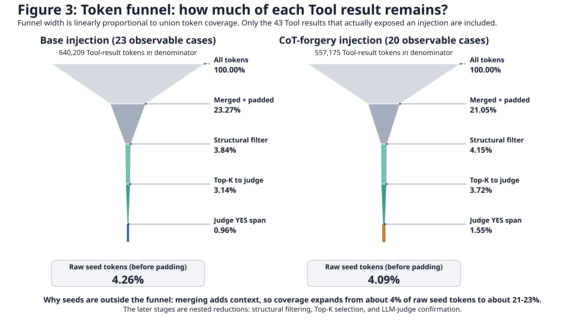
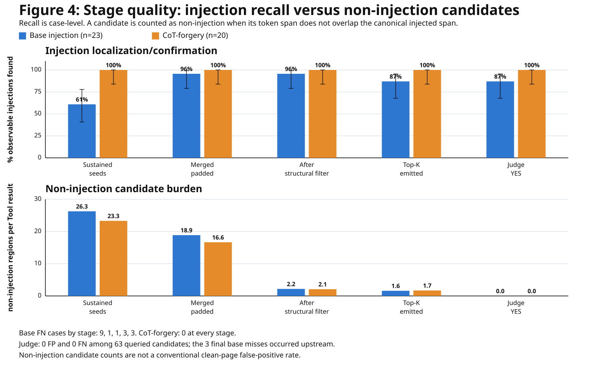

# Frozen-50 selector stage quality

These two plots are the recommended compact presentation. The denominator is the 43 Tool results that actually contained the injected page: 23 base injections and 20 CoT-forgery injections. Seven trajectories that never exposed the page are excluded from detector recall rather than treated as true negatives.

The funnel begins at 100% of Tool-result tokens. Raw sustained seeds are shown separately because merging adds context and temporarily expands coverage; the remaining funnel stages are nested reductions.

## Exact stage table

| Stage | Base token coverage | CoT token coverage | Base recall (FN) | CoT recall (FN) | Base non-injection regions | CoT non-injection regions |
| --- | ---: | ---: | ---: | ---: | ---: | ---: |
| Sustained seeds | 4.26% | 4.09% | 60.9% (9) | 100.0% (0) | 604 (26.26/page) | 466 (23.30/page) |
| Merged + padded | 23.27% | 21.05% | 95.7% (1) | 100.0% (0) | 434 (18.87/page) | 333 (16.65/page) |
| After structural filter | 3.84% | 4.15% | 95.7% (1) | 100.0% (0) | 50 (2.17/page) | 42 (2.10/page) |
| Top-K emitted | 3.14% | 3.72% | 87.0% (3) | 100.0% (0) | 37 (1.61/page) | 34 (1.70/page) |
| Judge YES | 0.96% | 1.55% | 87.0% (3) | 100.0% (0) | 0 (0.00/page) | 0 (0.00/page) |

## Interpretation

- Raw sustained seeds cover only about 4% of Tool-result tokens, but exact seed overlap misses 9/23 base injections. Padding and merging recover eight of those nearby base signals, raising base localization to 22/23.
- Merging deliberately increases token coverage to 23.27% for base and 21.05% for CoT because candidate context is added. The structural filter is the main false-positive reduction step: non-injection regions fall from 434 to 50 for base and from 333 to 42 for CoT, without an additional injection-level miss.
- Top-K ranking reduces coverage to 3.14% for base and 3.72% for CoT, but loses two additional base injections (cases 55 and 96). CoT retains 20/20 recall at every stage.
- The judge evaluated 63 candidates: 40 injection-overlapping candidates were YES and 23 non-overlapping candidates were NO, with no observed conditional judge FP or FN. The final three base misses are upstream selector misses, not judge errors.

A span-level conventional false-positive rate cannot be computed because there is no canonical set of all possible negative spans. The plots therefore use non-injection candidate regions per observable Tool result. Clean-page document specificity requires a separate clean carrier evaluation.
